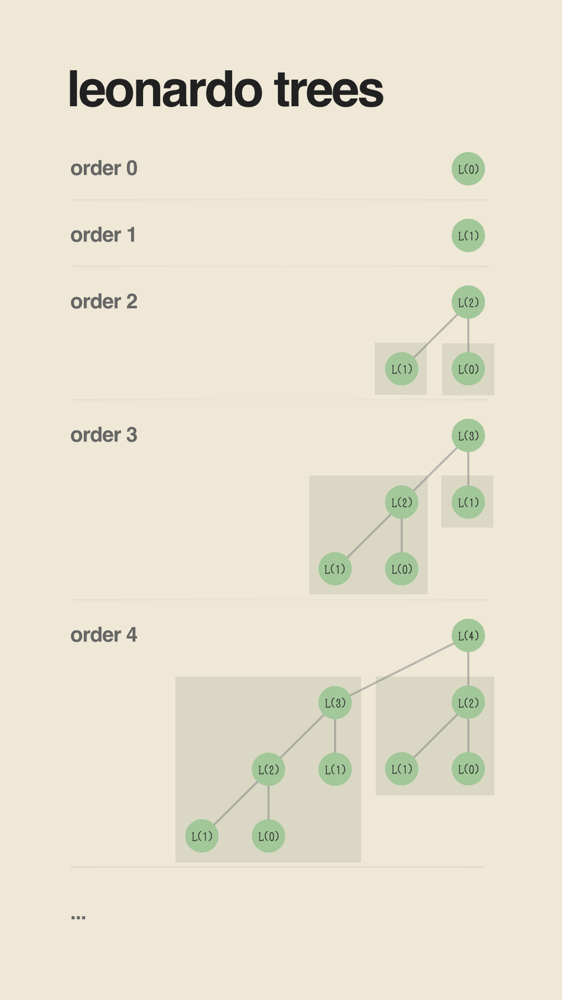
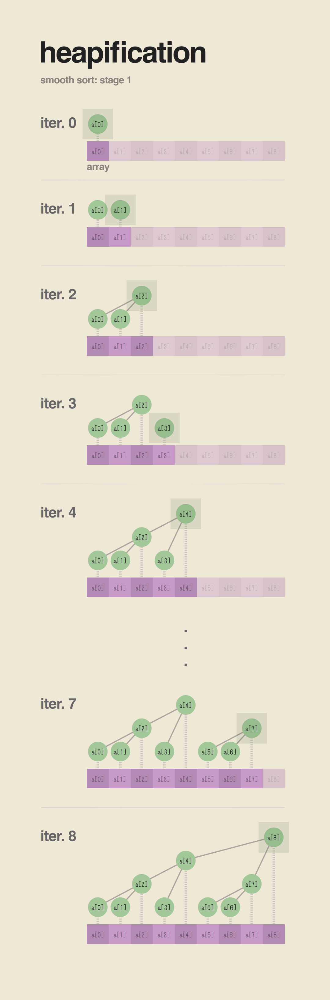

# 1. An Analysis of Sorting Algorithms
#### *by Mo David*

This repository currently only features a few select sorting algorithms. They are:

1. Insertion Sort
2. Selection Sort
3. Merge Sort
4. Heap Sort
5. Smooth Sort
6. Tim Sort

In hindsight, smooth sort was the most difficult to implement, but it also brought me the most insights and enjoyment. Because the implementations of the other algorithms are already widely-known, I put emphasis on explaining the mechanism of smooth sort below and leave out the others (except for Heap Sort... It'll become clear why I decided to explain this too).

Additionally, I'll outline the methods I used to benchmark the sorting algorithms. After much research, I decided to generate my own data sets (still using the `struct Record` provided by the starter code) to test the different implementations. I landed on a few ways to measure "entropy" (how shuffled an array is) to help me understand how the sorting algorithms would behave under different circumstances.

Likewise, to verify the amount by which the different algorithms would scale (in terms of execution time), the sizes of the custom data sets were varied too.

### 1.1 Running the Program

Compiling the program is relatively straightforward. Just use `gcc` and type the command `gcc main.c -o main`. The resulting built executable `main` can then be run. **For linux users**, I do leave another small but important note as the math library is not linked by default: if you are using a Linux device, run `gcc main.c -o main -lm` instead.

Depending on what exactly you want to run, the program accepts a number of different command-line arguments. They are listed below.

* `algos`, the algorithms to run, default is `insertion,selection,heap,merge,smooth,tim`.
* `N`, the number of records to sort, default is `100`.
* `P`, the shuffling amount (explained later), default is `1.0`.
* `cycles`, the number of cycles per run (explained later), default is `1`.
* `runs`, the number of runs per $(N, P)$ (also explained later in this document), default is `1`.
* `out`, the name of the file to write the results to, default is `output.csv`; of course, you may specify directories within the path.

So for example you could run the executable with the command `main algos=smooth,heap,merge N=500,5000,50000 P=0.005,0.05,0.5,1.0 cycles=5 runs=2`. This performs two runs for each pair of $(N,P)$, with each run having $5$ cycles (if what $(N,P)$ means is unclear, do not fret as this will be explained further later on; for immediate information on these concepts, including the definitions of runs and cycles, jump to the section on ***Comparisons and Individual Analyses***). You can leave out *any or all* of the arguments above, and the program will run with the default values assigned to the unspecified arguments. Also, **strictly no spaces** when inputting comma-separated arguments.

However, if you want to run the algorithms with the default datasets provided by the starter code, you can also specify the `debug` argument; instead of calling `./main`, you run `./main debug`. The resulting process will execute each of the algorithms ten different times for all of the starter datasets. The debug process also checks the sorted arrays and verifies that they are $(1)$ in the correct order and (2) not missing any entries (the second check was necessary for debugging algorithms that copied elements to temporary variables and pasted them elsewhere later; missing entries could result from flawed logic or bad coding). In the case of this project, the output of this process was redirected to a text file for later processing. It is good to note that both the aforementioned checks were passed by all algorithms for all the given datasets. More about these checks and their implementations will be explained in ***Comparisons and Individual Analyses***.

<!-- Detail how running the main program with different parameters can give different results -->

### 1.2 Creating Custom Tests

Because of the way the program is structured, it is possible to import `sortingalgorithms.c` into your own main function and test each of the following functions with your own data:

1. `Record_insertionSort(Record *records, int n)`
2. `Record_selectionSort(Record *records, int n)`
3. `Record_heapSort(Record *records, int n)`
4. `Record_mergeSort(Record *records, int n)`
5. `Record_smoothSort(Record *records, int n)`
6. `Record_timSort(Record *records, int n)`

Note how all the functions preserve the same signature to facilitate testing. Functions that use recursion (such as merge sort) have been abstracted into their own files to avoid succumbing to spaghetti code.

> <b style="color: rgba(255, 55, 55, 1); background-color: rgba(255, 55, 55, 0.16); padding: 4px 8px;">IMPORTANT REMINDERS</b>
>
> Please keep the following in mind to avoid any problems running your custom tests:
>
> 1. When importing `sortingalgorithms.c` and using any of the `Record_...Sort()` functions, <b style="color: rgba(255, 55, 55, 1);">DO NOT FORGET TO RUN</b> `Record_initSorters()` at the start of the main function (with no parameters). This function has to be run once before any of the sorting algorithms can work.
> 2. <b style="color: rgba(255, 55, 55, 1);">DO NOT MOVE</b> any of the files around to prevent breaking any of the imports.

### 1.3 A Note on Python Helper Files

Some might notice that the project contains a few Python files. These can be ignored and were simply used to automate the running of the C program. It allowed the possibility to perform batch tests without having to type the commands one after the other. Additionally, another Python script was also utilized to generate some of the visuals of this report (particularly those that graph data; the other illustrations were created in [Figma](https://figma.com/)).

# 2. Heap Sort

Heap sort has been described as ["selection sort using the right data structure"](https://link.springer.com/chapter/10.1007/978-3-030-54256-6_4). While that was not something that made sense to me a year ago, it was something that clicked during this project.

Heap sort treats the array differently: instead of viewing it as a sequential list of elements, heap sort visualizes it in the form of a tree, with the associations between parent nodes and child nodes outlined in a simple manner. Every $i^\text{th}$ element in the array is the child of the $\lfloor \frac{n - 1}{2} \rfloor^\text{th}$ entry and a parent of elements $2i + 1$ and $2i + 2$. By defining the tree in this way, adjacent nodes can be found easily at the expense of just a multiplication or two.

### 2.1 Why Do We Use A Tree?

But what benefit does a tree have over a sequential view of an array of elements? Because of the structure of a the tree (which is actually a max-heap), we are guaranteed to know that every element is greater than all its descendants. This invariant allows us to shift an element to its right place within the structure without having to compare it to every single element in the array; the motion associated with performing this action is vertical along the tree, and thus only depends on the height of the tree. This is wonderful because the height of a binary tree is always around $log_2(n)$ of the number of nodes $n$! Overall, visualizing the array in this manner allows us to execute a sort with minimal comparisons.

### 2.2 The Heap Sort Algorithm

As a brief outline of the actual heap sort algorithm (which I believe we must recall for the sake of understanding smooth sort), I present the following pseudocode:

```python
# The first step involves converting the array into a valid max-heap
# This operation takes nlogn steps.
for i = (array.length - 1) to i = 0:

    # Consider the subtree rooted at i, and sift the root down
    # Because we're starting with the leaves of the tree, this guarantees a valid max-heap at the end
    siftDown(array[i])

# The second step is the actual sorting
# We consider slices of the original array in decreasing length
for i = (array.length - 1) to i = 0:

    # Swap the largest element and bring it to the end of the current subarray
    swap(0, i);

    # Sift the new root of the max-heap
    # Since the max-heap was originally valid, we only need to sift the root to fix it
    # Because the root was the only thing swapped
    siftDown(array[0]);
```

It is also possible to optimize heap sort by starting the heapifying process at `i = pow(2, (int) log2(array.length)) - 1` (this is just the smallest power of 2 less than the array length); this is possible because the leaf nodes do not have children and it would be pointless to call the function `siftDown()` on them. Nevertheless, even though the current implementation does without this optimization, **heap sort is generally the fastest among the six sorting algorithms** that were chosen (at least according to the implementations within this project). For more information about the analyses and results, refer to the section on ***Comparisons and Individual Analyses***.

One important thing to note was that a different optimization was used to speed up heap sort. Originally, I managed to implement the algorithm exclusively using *swaps*. When sifting elements down the tree, a swap would occur at every level when it was possible. This meant copying two different records unto two different locations. However, upon saving the root in a temp variable and only "shifting" child nodes up instead of performing swaps (much like insertion sort shifts adjacent elements rather than swapping to the end), heap sort ran about twice as fast as it did in the initial runs (although sadly I do not have data for the initial implementation of heap sort I did). This makes sense given the fact that the act of copying data was cut in half.

Anyway, on to the fun part...

# 3. Smooth Sort

The reason I decided to explain heap sort prior to smooth sort is because the two algorithms rely on the same fundamental idea: visualizing an array in a manner that differs from its linear structure. However, smooth sort attempts to remedy a certain problem with heap sort: the largest element of the array is always at the root (the beginning) of the array, when ultimately it must end up at the opposite end. This means that regardless of the initial state of our array, $n \cdot \log n$ operations must necessarily happen. Heap sort does not care whether or not our data is sorted to some degree.

Smooth sort, on the other hand, takes an unorthodox approach. For one, it doesn't create a single tree but rather a *forest of max-heaps*. For another, it builds these trees such that their root nodes are on the right. This entails way less computations for lists that are close to being sorted. It also means that smooth sort, in the best case, is $\mathcal{O}(n)$! Note that as amazing as this sounds, we will see towards the latter half of this paper (again, in the section ***Comparisons and Individual Analyses***) whether or not the merit this brings is of any practical value.

But how does it work, exactly?

### 3.1 Leonardo Numbers and Leonardo Heaps

Before we discuss the underlying structure of the max-heaps created by smooth sort, I wish to bring forth the idea of [the Leonardo numbers](https://en.wikipedia.org/wiki/Leonardo_number). The Leonardo numbers are just an integer sequence defined by the recurrence:

$$
\begin{align}
L(0) &= 1 \\
L(1) &= 1 \\
L(i) &= L(i - 1) + L(i - 2) + 1 \\
\end{align}
$$

To the acute reader, this might seem rather similar to the Fibonacci sequence, aside from the $+1$ embedded into each iteration. Indeed, the two sequences are actually related by a simple formula, and this relationship is essential to proving the $\mathcal{O}(n \log n)$ behaviour of smooth sort, but as neat as this may be, it is beyond the scope of this report (although you may ask me in person if you wish).

Now consider for a moment trees with $L(i)$ nodes. If we structure the trees such that the left subtree contains $L(i - 1)$ nodes and the right subtree contains $L(i - 2)$ nodes, then the trees have the amazing property of being recursively defined by the Leonardo sequence. Equivalently, given any two trees with $L(i - 1)$ and $L(i - 2)$ nodes respectively, a new tree with $L(i)$ nodes can be constructed from the other two by adding a new root node (thus the $+1$ above). Because every node has at most two children, these trees are binary trees. From hereon, adopting the terminology used by [this article](https://www.keithschwarz.com/smoothsort/), we will refer to these trees as *Leonardo trees*, and such a tree with $L(k)$ nodes is a Leonardo tree of *order* $k$.



Smooth sort uses Leonardo trees to visualize the array.

### 3.2 Generating the Forest

Generating the forest of Leonardo trees for smooth sort is more straightforward than it sounds. The illustration below will likely do better to explain the process, but I will try to outline it regardless. The process relies on the fact that any number can be expressed as the sum of a subset of the Leonardo numbers. This fact can be proven through mathematical induction, though again, we refuse to wander beyond the scope of this report.

We begin by starting at the left of the array and proceeding rightwards until the last element is reached. During each iteration, the current element is added as the root of the rightmost tree in the forest, and the corresponding tree is heapified to ensure it is a valid max-heap. We can see the progression of the process below, where the newly added node is highlighted for each iteration. Whenever this newly added node has child nodes, we call a `siftDown()` function to maintain the max-heap property of the tree (note that like heap sort, the `siftDown()` we use for smooth sort doesn't rely on swaps but shifts).



The exact rules for deciding whether or not to append the next element as a root node or as a singleton are simple: if the two rightmost Leonardo trees in the forest have adjacent orders, then we merge those two (alongside the new root) to create a Leonardo tree of the next order. Otherwise, we add a singleton node. The actual code uses the bits of an `unsigned int` to keep track of the orders of the Leonardo trees currently in the forest: a $1$ on the $k\text{th}$ least-significant bit (LSB) of the variable signifies that a Leonardo tree of order $k$ is present. Do note that because of this method, we are restricted to sorting arrays that hold a number of elements no more than the sum of the first $32$ Leonardo numbers (that's a few million records; if we want to circumvent this, we can just use an `unsigned long`). 

### 3.3 Sorting Using the Heapified Trees

# 4. Tim Sort

Now I won't bother going in-depth with tim sort; it's not really the main algorithm I chose anyway. Nevertheless, I feel like it deserves a special mention. The original publication outlining tim sort actually takes inspiration [from another academic paper](https://dl.acm.org/doi/10.5555/313559.313859) which led me down a rabbit hole of information theory. This eventually helped me realize my ideas on how to benchmark the sorting algorithms.

Some caveats with the implementation of tim sort used by this project: it's not adaptive, and it's not completely faithful to the original. For one, the run size doesn't change based on the number of records, although in practice it should adapt to try and minimize the number of resulting merges utilized by the algorithm. Aside from this, the algorithm also performs merges only after defining the runs, as opposed to performing them when merge criteria are satisfied. Nevertheless, contrary to these oversimplifications, I still refer to this version of the algorithm as tim sort, since a lot of the implementations found online follow this pattern (despite their apparent irreverence to the original).

# 5. Shuffling, Entropy, and Correlation

### 5.1. Shuffling

There is a well-known shuffling algorithm that generates a permutation of the elements of a sequence in a *reliably-random* way. By this, we mean to say that every possible permutation is equally likely, and the shuffling process does not favor any single one. This is called the [Fisher-Yates algorithm](https://en.wikipedia.org/wiki/Fisher%E2%80%93Yates_shuffle).

It's actually simpler than it sounds: you traverse an array of elements starting from the last element. At every element $k$, you randomly choose a new index $k'$ within the range $[0, k]$ and perform a swap with those two indices. You do this until you reach the start of the array. In pseudocode:

```Python
for k = (array.length - 1) to k = 0:
    k' = random number from 0 to k
    swap array[k] with array[k']
```

Despite it's simplicity, it reliably selects a permutation of the original array in a uniform manner (assuming your random function for choosing a number between each $[0, k]$ is unbiased).

To perform shuffling for this project, a slight variation of the original algorithm is used. Whereas the original Fisher-Yates always executes a shuffle for each element, the variation used here only performs swaps probabilitically. A swap happens $P$ amount of the time ($P=1$ means we always swap, $P=0$ means we never swap). In pseudocode:

```Python
for k = (array.length - 1) to k = 0:
    k' = random number from 0 to k
    t = random float from 0 to 1

    if t <= P and t > 0:
        swap array[k] with array[k']
```

In the implementation, things are notated a bit differently and we have $<$ instead of $<=$, but that's okay because the computations in the actual code account for that subtlety.

When performing a shuffle on data, it's helpful to know just how much of a shuffle we were able to do. To help us measure this idea of "shuffling", we come up with two metrics, the first of which is entropy.

### 5.2. Entropy

Entropy is often associated with the idea of disorder. Fundamentally, the concept of "disorder" is not too far from the concept of "messing up" a deck of cards, although context necessitates that we refer to the second case as [information entropy](https://en.wikipedia.org/wiki/Entropy_(information_theory)#:~:text=Generally%2C%20information%20entropy%20is%20the,referred%20to%20as%20Shannon%20entropy.). Interestingly enough, both information theory and statistical mechanics have characterized their notions of entropy in much the same way. We focus on the formulation Claude Shannon provided for information theory (who impressively came up with the form [independent of any knowledge of statistical mechanics](https://mathoverflow.net/questions/403036/john-von-neumanns-remark-on-entropy)):

<br>

$$
\begin{align}
E = -\sum_{x \in S} p_x \cdot ln(p_x)
\end{align}
$$

<br>

gives the entropy of a discrete random variable $X$, where for some $x$ in the sample space $S$, $p_x$ is $\text{I\kern-0.15em P}(X=x)$. The important thing to see here is that we're multiplying the probabilities of each of the outcomes in the sample space by how "surprising" they are. That's all $-ln(p_x)$ is telling us, because:

<br>

$$
\begin{align}
& -ln(p_x) \\
& =ln(\frac{1}{p_x})
\end{align}
$$

<br>

When $p_x=1$, then the event isn't suprising at all and the value above reduces to $0$. On the other hand, for smaller values of $p_x$, the value above increases and indicates that the event is "more surprising". Vaguely speaking maximizing entropy means "maximizing surprise and uncertainty", and this is achieved by dispersing our random variable across all possible values of the sample space. If some event were highly likely, then most of the time the outcome wouldn't surprise us at all. But if every outcome were equally likely, then each outcome would be very "surprising" because we would have no idea which one would likely happen next (as a fair warning, don't take the word "surprising" to mean anything rigorous here; it's only meant to be an analogy).

So how can we use this to analyze the "shuffledness" of our arrays? Entropy manifests in our sequences of records when it becomes hard to expect which record comes after a given record. In a sorted list (or a list with some structure to it), this is easy because the records form a sort of pattern. Thus, when traversing the array, at any given point, it is reasonable to have an expectation for what the next record might be (it won't be anything surprising). However, when an array is shuffled really well, it becomes really hard to tell what record might come next, and so things are "uncertain" and "surprising". 

[To approach this more rigorously](https://stats.stackexchange.com/questions/78591/correlation-between-two-decks-of-cards/79552#79552), we define a random variable $X$ to represent the possible differences between any two adjacent records. That is, for any two adjacent records $r_i$ and $r_{i + 1}$ along the shuffled array, we define $x_i$ to be

<br>

$$
\begin{align}
x_i = s(r_{i + 1}) - s(r_{i})
\end{align}
$$

<br>

where $s(r_i)$ returns the index of the record *in the sorted array*. Thus, a highly entropic array will have $X$ vary considerably, whereas in a sorted array, $P(X=1)$ is $1$ and no other differences occur.

Do note that in order for this approach to work, we adjust negative differences to fall within the range $[0, N-1]$ ($N$ is the number of records). We do this by adding $N$ whenever $x_i < 0$. Effectively, this just gives us the residue of $x_i \text{ mod } N$. If we were to leave this step out, our computation for entropy would likely have its terms cancel out, and we would end up with 0 when in fact the system displays a high degree of entropy.

### 5.3. Correlation (or Rather, Determination)

[Another useful idea](https://stats.stackexchange.com/questions/78591/correlation-between-two-decks-of-cards/) to help us assess the "shuffledness" of an array is correlation. Using the same function $s(r_i)$ from above, we can create a rough estimate of the disorder in our array by determining the strength of the correlation between $i$ and $s(r_i)$. A sorted array will always have $i=s(r_i)$ (that is, the values of the sorted indices of the records are equal to their current position in the array), and would produce a correlation of exactly $1$. An unsorted array, however, will likely have a very small correlation value (something close to 0). Unlike entropy, our scale goes in the opposite direction within the interval $[0, 1]$.

However, there is something else we must account for: if the array was in reverse, it wouldn't be considered "well-shuffled" (it's far from sorted, but it's not really jumbled up) and correlation would give us a value of $-1$. This is fine because it isn't $0$ (which would indicate complete disorder), but it would be better to restrict all our values within the positive range of $[0, 1]$. To avoid dealing with negative numbers, we square the value we obtain for the correlation. This particular number is used a lot in inferential statistics and has a special name: [the coefficient of determination](https://en.wikipedia.org/wiki/Coefficient_of_determination). Although this number has a few different interpretations, we ignore most of these as they do not apply to our framework. However, we must acknowledge the relevance this metric has (henceforth referred to as $r^2$) in describing the disorder within a set of data.

# 6. Comparisons and Individual Analyses

This section discusses the two different methods used to compare and analyze the different algorithms. The first uses the provided datasets for the project; there are seven of these, and all algorithms we're allowed to run on them. The second involves a testing framework specifically coded for this project. Do note, however, that flexibility was considered in designing this system, and the framework may be used to benchmark other sorting algorithms (even ones that don't use the `Record` data structure) so long as they follow the interfaces required by the framework.

### 6.1 Testing with the Starter Datasets

This test was relatively straightforward. To ensure the reliability of the measured durations, each algorithm was run ten times on all of the provided datasets. The results were then recorded unto a text file (encoded by the executable by piping its text output) and are summarized by the table below. Note that all the values depicted here represent the average duration taken by the algorithm across the ten different attempts of sorting each dataset (and thus contain an extra significant figure).

| Dataset / Algorithm   | Insertion Sort | Selection Sort | Heap Sort  | Merge Sort | Smooth Sort | Tim Sort   |
| --------------------- | -------------- | -------------- | ---------- | ---------- | ----------- | ---------- |
| `random100.txt`       | $0.3$ ms       | $0.3$ ms       | $0.2$ ms   | $0.2$ ms   | $0.4$ ms    | $0.2$ ms   |
| `random25000.txt`     | $8249.3$ ms    | $3395.1$ ms    | $40.6$ ms  | $63.9$ ms  | $99.5$ ms   | $49.3$ ms  |
| `random50000.txt`     | $37339.8$ ms   | $17930.9$ ms   | $90.6$ ms  | $141.4$ ms | $238.0$ ms  | $114.4$ ms |
| `random75000.txt`     | $90797.0$ ms   | $48789.1$ ms   | $160.7$ ms | $265.9$ ms | $404.1$ ms  | $235.2$ ms |
| `random100000.txt`    | $167628.7$ ms  | $91376.1$ ms   | $229.0$ ms | $357.1$ ms | $513.8$ ms  | $313.3$ ms |
| `almostsorted.txt`    | $32694.2$ ms   | $91235.9$ ms   | $173.6$ ms | $331.4$ ms | $187.8$ ms  | $285.0$ ms |
| `totallyreversed.txt` | $335970.4$ ms  | $103090.6$ ms  | $148.7$ ms | $338.6$ ms | $366.4$ ms  | $298.1$ ms |

As expected, both $\mathcal{O}(n^2)$ algorithms had runtimes that increased significantly with respect to the problem size. In the worst case scenario (sorting a list in reverse), insertion sort took around $5 \frac{1}{2}$ mins, while selection sort took a little over $1 \frac{1}{2}$ mins. While selection sort is supposed to run at about the same time for a given problem size (regardless of the shuffle) because it always performs the same number of comparisons for a given $N$, the slight increase in execution time observed for `totallyreversed.txt` is likely due to the increased *number of swaps* performed by selection sort.

For the $\mathcal{O}(n \log n)$ algorithms, we make some interesting observations. While merge sort behaves as expected and always runs in approximately $\mathcal{O}(n \log n)$ regardless of the provided shuffle, heap sort performs considerably better on data that's almost sorted and data that's structured in reverse. Based on our discusion of entropy above, we know that both of these datasets should have low measures of disorder (a reversed array isnt shuffled that well, it's just in the opposite order), and as we will see in the analyses of the succeeding section, heap sort performs considerably better for datasets with low entropy. Almost the same can be said for smooth sort, although it does have a preference for the correct ordering of data.

### 6.2 The Custom Testing Framework: Methodology

As mentioned a number of times above, a testing framework was also constructed to aid in the comparison and analyses of the different algorithms. The framework allows us to execute a number of different *runs*, each of which perform a set of specific *cycles*. In this case, a run refers to different shufflings of records for a given $(N, P)$, while a cycle refers to a set of attempts (for all algorithms) to sort a certain shuffle. Multiple cycles ensure that we account for the actual time it takes each algorithm to sort a given array (in case outliers of bad timing happen to be present); runs allow us to be confident that the times we're getting aren't for a particularly "good" or "bad" shuffle (the shuffle wasn't unlikely). If this still isn't clear, the pseudocode below should elucidate what I mean:

```python

# This performs a test for a given N and a given P
set value of N
set value of P

# Testing algorithm for a given N and P
for i in number of runs:
    shuffle = new shuffle of records according to N and P
    times = 2d array to store execution times, init to all 0s

    # Perform the required number of cycles
    for j in number of cycles:

        # Do the sort for each algorithm
        for algo in algorithms:
            tosort = copy order of shuffled records
            
            start = get start time
            algo.sort(tosort)
            end = get end time

            times[algorithm][run] = end - start
        
    # Get the average of all cycles for this run
    times[algorithm][run] /= number of cycles
```

Note that when we "save data somewhere else", we're saving it alongside the values of $N$ and $P$ that were used for those runs. The choice of $(N, P)$ definitely affects the times we will be seeing, and so it is imperative we keep track of them. Additionally, the choice for the number of cycles is often set to `cycles=5`, while runs have `runs=5`.

### 6.3 The Custom Testing Framework: Results and Analysis

<!-- Mention P and N here again -->

### 6.4 The Custom Testing Framework: Individual Algorithms

# 7. Recommendations, Afterthoughts, and Anecdotes

There were some things I realized during the project which I wish I had realized much sooner. If I had, then maybe I would've pulled those things off before submitting this project. Nevertheless, I leave them here as recommendations due to a lack of time.

### 7.1 Smooth Sort Bug: C Behaves Differently on Different Platforms

### 7.2 Correlation, NOT Determination

Towards the latter half of the testing phase, I realized how much more valuable it would be to measure the *coefficient of correlation* and not the coefficient of determination. While the initial idea was to use the latter metric because I thought measuring 'shuffledness' was sufficient, I later realized that knowing the 'bias' of a dataset (whether it tends to be in the *right order* or in *reverse*) would just be as insightful, since some of the algorithms obviously perform differently based on this. In this case, correlation would definitely give us more insights to work with.

# 8. Author

```
                                                    |\      _,,,---,,_
                                             ZZZzz /,`.-'`'    -.  ;-;;,_
                                                  |,4-  ) )-,_. ,\ (  `'-'
                                                 '---''(_/--'  `-'\_)
```