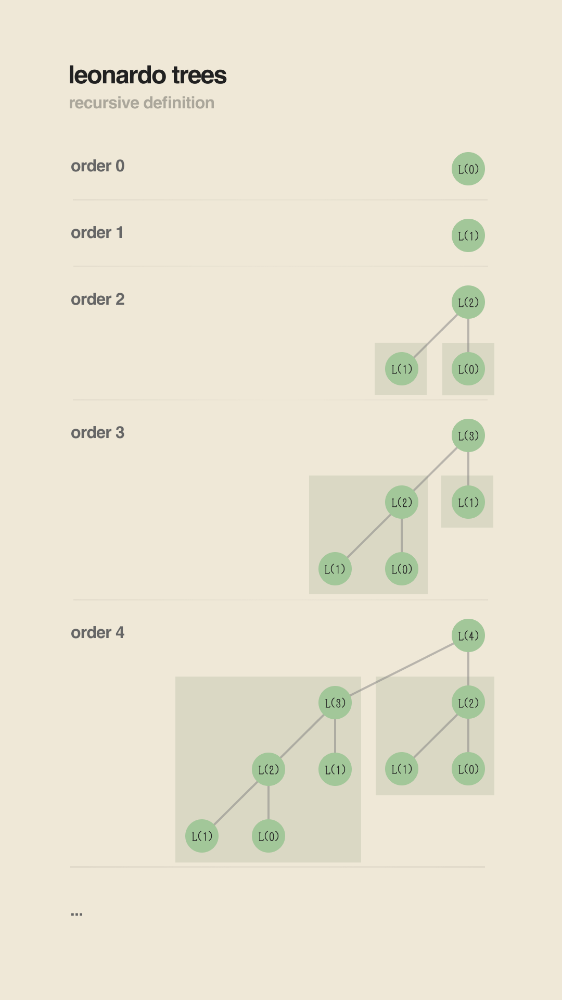
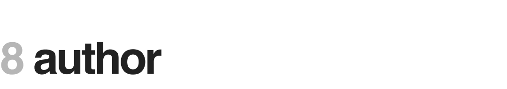

<!-- 
PLEASE READ THE HTML FILE INSTEAD.
PLEASE READ THE HTML FILE INSTEAD.
PLEASE READ THE HTML FILE INSTEAD.
 -->


---

This repository currently only features a few select sorting algorithms. They are:

1. Insertion Sort
2. Selection Sort
3. Merge Sort
4. Heap Sort
5. Smooth Sort
6. Tim Sort

In hindsight, smooth sort was the most difficult to implement, but it also brought me the most insights and enjoyment. Because the implementations of the other algorithms are already widely-known, I place an emphasis on explaining the mechanism of smooth sort below and combine the others into a single section: ***Other Algorithms***. However, I've elected to devote a separate section for Heap Sort; this precedes my discussion of smooth sort (it'll become clear why I decided to explain this too).

The following report will also outline the methods that were used to benchmark the sorting algorithms. After much research, I decided to procedurally generate custom data sets (still using the `struct Record` provided by the starter code). These were created using a number of parameters (particularly, the number of records ($N$) and the shuffle amount ($P$), which we elaborate further in the sections below), and the integrity of the resulting shuffles were measured using well-defined metrics (in this case, entropy ($H$), correlation ($r$), and determination($r^2$)—again, more on these later). All in all, the parameters and measurements provided a richer context for analyzing the behavior of the algorithms under different circumstances. As per with the specifications of the project, both the execution times ($t$) and frequency counts ($f$) were recorded.

### 1.1 Running the Program

Compiling the program is relatively straightforward. Just use `gcc` and type the command `gcc main.c -o main`. The resulting executable `main` can then be run. **For linux users**, I do leave another small but important note as the math library is not linked by default: if you are using a Linux device, run `gcc main.c -o main -lm` instead.

Depending on what exactly you want to run, the program accepts a number of different command-line arguments. They are listed below.

* `algos`, the algorithms to run, default is `insertion,selection,heap,merge,smooth,tim`.
* `N`, the number of records to sort, default is `100`.
* `P`, the shuffling amount, default is `1.0`.
* `cycles`, the number of cycles per run, default is `1`.
* `runs`, the number of runs per $(N, P)$, default is `1`.
* `out`, the name of the file to write the results to, default is `output.csv`; of course, you may specify directories within the path.

So for example you could run the executable with the command `main algos=smooth,heap,merge N=500,5000,50000 P=0.005,0.05,0.5,1.0 cycles=5 runs=2`. This performs two runs for each pair of $(N,P)$, with each run having $5$ cycles (if any of these terms seem vague or unclear, do not fret as these will be defined later on; for immediate information on them, jump to the section on ***Comparisons and Individual Analyses***). You can leave out *any or all* of the arguments above, and the program will run with the default values assigned to the unspecified arguments. The order of the arguments does not matter; that is, calling `./main N=1000,2000 P=1.0` and `./main P=1.0 N=2000,1000` would run the same routines. However, note that **strictly no spaces** are allowed when inputting the comma-separated values.

If you want to run the algorithms with the default datasets provided by the starter code, you can also specify the `debug` argument; instead of calling `./main`, you run `./main debug`. The resulting process will execute each of the algorithms ten times for all of the starter datasets. The output of this process is not saved to a file, although the printed text can be piped into one if this is desired.

Note that for all tests, the integrity of the sorted arrays are automatically verified. It is ensured that **(1)** they are in the right order and **(2)** they have no missing entries. For more information on the specific implementation of these, head over to ***Comparisons and Individual Analyses***.

### 1.2 Creating Custom Tests

Because of the way the program is structured, it is possible to import `sortingalgorithms.c` into your own main function and test each of the following functions with your own data:

1. `Record_insertionSort(Record *records, int n)`
2. `Record_selectionSort(Record *records, int n)`
3. `Record_heapSort(Record *records, int n)`
4. `Record_mergeSort(Record *records, int n)`
5. `Record_smoothSort(Record *records, int n)`
6. `Record_timSort(Record *records, int n)`

Note how all the functions preserve the same signature to facilitate testing. Functions that use recursion (such as merge sort) have been abstracted into their own files to avoid succumbing to spaghetti code.

To gather the frequency counts on your own, simply call the corresponding `Record_get<sorter>SortFreq()` function. For instance, after calling `Record_heapSort(records, N)` for some variables `records` and `N`, I can then do something like `printf("heap sort frequency count: %ld", Record_getHeapSortFreq())`. The frequency count value is always of type `long`. 

> <br/>
> <b style="color: rgba(255, 55, 55, 1); background-color: rgba(255, 55, 55, 0.16); padding: 4px 8px;">IMPORTANT REMINDERS</b>
>
> Please keep the following in mind to avoid any problems running your custom tests:
>
> 1. When importing `sortingalgorithms.c` and using any of the `Record_<sorter>Sort()` functions, <b style="color: rgba(255, 55, 55, 1);">DO NOT FORGET TO RUN</b> `Record_initSorters()` at the start of the main function (with no parameters). This function has to be run once before any of the sorting algorithms can work.
> 2. <b style="color: rgba(255, 55, 55, 1);">DO NOT MOVE</b> any of the files around to prevent breaking any of the imports.
> 
> <br/>

### 1.3 A Note on Python Helper Files

Some might notice that the project contains a few Python files. These can be ignored and were simply used to automate the running of the C program. It allowed the possibility to perform batch tests without having to type the commands one after the other (this was necessary for my device because creating a bulk command that ran the C executable for more than a few minutes in a single process caused it to be killed by the OS). Additionally, another Python script was also utilized to generate some of the visuals of this report (particularly those that graph data; the other illustrations were created in [Figma](https://figma.com/)).


---

Heap sort has been described as ["selection sort using the right data structure"](https://link.springer.com/chapter/10.1007/978-3-030-54256-6_4). While that was not something that made sense to me a year ago, it was something that clicked during this project. Both of them select the smallest (or largest) element within an array and move them to their proper location; however, heap sort does this in $\mathcal{O}(\log n)$ time while selection sort takes $\mathcal{O}(n)$.

Heap sort treats the array differently: instead of viewing it as a sequential list of elements, heap sort visualizes it in the form of a tree, with the associations between parent nodes and child nodes outlined in a simple manner. Every $i^\text{th}$ element in the array is the child of the $\lfloor \frac{n - 1}{2} \rfloor^\text{th}$ entry and a parent of elements $2i + 1$ and $2i + 2$. By defining the tree in this way, adjacent nodes can be found easily at the expense of just a multiplication or two.

### 2.1 Why Do We Use A Tree?

But what benefit does a tree have over a sequential view of an array of elements? Because of the structure of a the tree (which in the case of heap sort is actually a max-heap), we are guaranteed to know that every element is greater than all its descendants. This invariant allows us to shift an element to its right place within the structure without having to compare it to every single element in the array; the motion associated with performing this action is vertical along the tree, and thus only depends on the height of the tree. This is wonderful because the height of a binary tree is always around $log_2(n)$ of the number of nodes $n$! Thus, visualizing the array in this manner allows us to execute a sort with $\mathcal{O}(\log n)$ comparisons per pass (giving us a total runtime of $\mathcal{O}(n \log n)$).

### 2.2 The Heap Sort Algorithm

As a brief outline of the actual heap sort algorithm (which I believe we must recall for the sake of understanding smooth sort), I present the following pseudocode:

```python
# The first step involves converting the array into a valid max-heap
# This operation takes nlogn steps.
for i = (array.length - 1) to i = 0:

    # Consider the subtree rooted at i, and sift the root down
    # Because we're starting with the leaves of the tree, this guarantees a valid max-heap at the end
    siftDown(array[i])

# The second step is the actual sorting
# We consider slices of the original array in decreasing length
# Again, this entire operation takes nlogn
for i = (array.length - 1) to i = 0:

    # Swap the largest element and bring it to the end of the current subarray
    swap(0, i);

    # Sift the new root of the max-heap
    # Since the max-heap was originally valid, we only need to sift the root to fix it
    siftDown(array[0]);
```

All in all, given that the two operations take $\mathcal{O}(n \log n)$ time, executing them one after the other must also take $\mathcal{O}(n \log n)$.

It is also possible to optimize heap sort by starting the heapifying process at `i = pow(2, (int) log2(array.length)) - 1` (this is just the smallest power of $2$ less than the array length); this is possible because the leaf nodes do not have children and it would be pointless to call the function `siftDown()` on them. Nevertheless, even though the version of heap sort in this project does not use this optimization, **heap sort is generally the fastest among the six sorting algorithms** that were chosen (at least according to the implementations of this project). For more information about the analyses and results, refer to the section on ***Comparisons and Individual Analyses***.

One important thing to note was that a different optimization was used to speed up heap sort. Originally, I managed to implement the algorithm exclusively using *swaps*. When sifting elements down the tree, a swap would occur at every level when it was possible. This meant copying two different records unto two different locations. However, upon saving the root in a temp variable and only "shifting" child nodes up instead of performing swaps (much like insertion sort shifts adjacent elements rather than swapping to the end), heap sort ran about twice as fast as it did in the initial runs (although sadly I did not save the data for the initial implementation of heap sort I had). This makes sense given the fact that the act of copying data was cut in half.

Anyway, on to the fun part...


---

The reason I decided to explain heap sort prior to smooth sort is because the two algorithms rely on the same fundamental idea: visualizing an array in a manner that differs from its linear structure. However, smooth sort attempts to remedy a certain problem with heap sort: the largest element of the array is always at the root (the beginning) of the array, when ultimately it must end up at the opposite end. This means that regardless of the initial state of our array, $n \cdot \log n$ operations must necessarily happen. Heap sort does not care whether or not our data is sorted to some degree.

Smooth sort, on the other hand, takes an unorthodox approach. For one, it doesn't create a single tree but rather a *forest of max-heaps*. For another, it builds these trees such that their root nodes are on the right. This entails way less computations for lists that are close to being sorted. It also means that smooth sort, in the best case, is $\mathcal{O}(n)$! Note that as amazing as this sounds, we will see towards the latter half of this paper (again, in the section ***Comparisons and Individual Analyses***) whether or not its merits are of any practical value.

But how does it work, exactly?

### 3.1 Leonardo Numbers and Leonardo Heaps

Before we discuss the underlying structure of the max-heaps created by smooth sort, I wish to bring forth the idea of [the Leonardo numbers](https://en.wikipedia.org/wiki/Leonardo_number). The Leonardo numbers are just an integer sequence defined by the recurrence:

<br/>

$$
\begin{align}
L(0) &= 1 \\
L(1) &= 1 \\
L(i) &= L(i - 1) + L(i - 2) + 1 \\
\end{align}
$$

<br/>

To the acute reader, this might seem rather similar to the Fibonacci sequence, aside from the $+1$ embedded into each iteration. Indeed, the two sequences are actually related by a simple formula, and this relationship is essential to proving the $\mathcal{O}(n \log n)$ behavior of smooth sort. But as neat as this may be, it is beyond the scope of this report (although you may ask me in person if you wish).

Now consider for a moment trees with $L(i)$ nodes. If we structure the trees such that the left subtree contains $L(i - 1)$ nodes and the right subtree contains $L(i - 2)$ nodes, then the trees have the amazing property of being recursively defined by the Leonardo sequence. Equivalently, given any two trees with $L(i - 1)$ and $L(i - 2)$ nodes respectively, a new tree with $L(i)$ nodes can be constructed from the other two by adding a new root node (thus the $+1$ above). Because every node has at most two children, these trees are binary trees. From hereon, adopting the terminology used by [this article](https://www.keithschwarz.com/smoothsort/), we will refer to these trees as ***Leonardo trees***. Given a Leonardo tree with $L(k)$ nodes, we define its ***order to be*** $k$.



Whereas heap sort uses a single complete binary tree to represent the array, smooth sort uses a forest of Leonardo trees instead.

### 3.2 Generating the Forest

Generating the forest of Leonardo trees for smooth sort is more straightforward than it sounds. The illustration below will likely do better to explain the process, but I will try to outline it regardless. The process relies on the fact that any number can be expressed as the sum of a subset of the Leonardo numbers. We can prove this using mathematical induction, though again, we refuse to wander beyond the scope of this report.

We begin by starting at the left of the array and proceed rightwards until the last element is reached. During each iteration, the current element is either **(1)** added as a new tree on its own (a singleton), or **(2)** added as the root of a new tree consisting of the two rightmost trees in the forest. In the second case, the new tree is heapified to ensure it is a valid max-heap and a `siftDown()` function is called (note that like heap sort, the `siftDown()` we use for smooth sort doesn't rely on swaps but shifts). We can see the progression of the process below, where the newly added node is highlighted for each iteration.


The exact rules for deciding whether or not to append the next element as a root node or as a singleton are simple: if the two rightmost Leonardo trees in the forest have adjacent orders (one if of order $k$ and another of order $k - 1$), then we merge those two (alongside the new root) to create a Leonardo tree of the next order ($k + 1$). Otherwise, we add a singleton node. The actual code uses the bits of an `unsigned int` to keep track of the orders of the Leonardo trees currently in the forest: a $1$ on the $k^\text{th}$ least-significant bit (LSB) of the variable signifies that a Leonardo tree of order $k$ is present. Do note that because of this method, we are restricted to sorting arrays that hold a number of elements no more than the sum of the first $32$ Leonardo numbers (that's a few million records; if we want to circumvent this, we can just use an `unsigned long`). For the purposes of this project, this is more than enough.

### 3.3 Sorting the Roots of the Heapified Trees

Before we can proceed with the actual sorting, we need to cover another subroutine of smooth sort. After it generates the forest of max-heaps, it must guarantee that the root of the rightmost tree is the greatest element in the array. This allows it to remove that node from the forest and place it into the sorted portion of the array (which is where it happens to be already). But for this to be true, the roots of all the trees in the forest must be sorted in ascending order. Sorting the roots of the Leonardo trees represents the second intermediate stage of the algorithm.


Note that we perform an insertion sort for each of the roots starting from the leftmost tree. At the end of each pass, the last modified tree is heapified (and the rest are left as is: if the root of a max-heap is replaced by a greater element, the max-heap property must still be satisfied by that heap). Eventually, the roots will be in ascending order.

### 3.4 Sorting Using the Heapified Trees

Once the roots have been sorted, we can begin removing the greatest element of the forest until the array is fully sorted. Since the greatest element must always be the root of the rightmost tree, there is no need to move this element; rather, it is the structure of the heaps that change with each iteration.

During each root removal, either one of two things will happen: **(1)** the root leaves behind no subtrees because it was a singleton, in which case we can proceed to remove the next root, or **(2)** the root exposes two new subtrees, the roots of which must be rearranged with the roots of the existing trees on their left. In the second case, we repeat the process illustrated in the previous subsection to maintain the property that all the roots within the forest are in ascending order; however, instead of doing this for all the roots, we only do this for the roots of the exposed subtrees (the rest of the roots should still be in order). Eventually, we reach the end of the array and arrive at a sorted list.

Note that for each iteration, performing insertion sort on the new roots (if there are any) will take at most $\mathcal{O}(\log n)$ time because every array of length $N$ can be expressed as the sum of at most $\log n$ Leonardo numbers; in other words, we have about a logarithmic number of Leonardo heaps (with respect to the array size) at any given time. Heapifying the modified trees at the end of this insertion also takes $\mathcal{O}(\log n)$. We can add these together, and overall, each pass still takes $\mathcal{O}(\log n)$. If we multiply this by the number of iterations required, we get $\mathcal{O}(n \log n)$. Adding this with the time complexity of the first stage of smooth sort still yields $\mathcal{O}(n \log n)$.

No illustrations exist for this part of the algorithm, as the other illustrations suffice to provide an explanation for this already. Follow the first stage of smooth sort in reverse, and it should be easy to visualize how root removal looks; repeat the process outlined by the second stage, and understanding how each iteration sorts new roots should become clear. 

It is left as an exercise to the reader to understand how smooth sort approaches linear time for nearly-sorted lists... (or you can ask me in person).


---

### 4.1 Insertion Sort and Selection Sort

Insertion sort and selection sort are both $\mathcal{O}(n^2)$ algorithms. However, they have a few nuances that make one better than the other in certain situations.

Selection sort always performs the same number of comparisons, regardless of the state of the array. This means that when the given array is already sorted, selection sort won't even know about it until it's compared every pair of elements together. Insertion sort, on the other hand, can run in $\mathcal{O}(n)$ time in the best case. Because it only ever compares elements that are adjacent to each other, these comparisons can end up "terminating" a pass prematurely when the array is already sorted.

Selection sort "selects" the smallest (or greatest) element left in the ***unsorted portion** of the array*. Insertion sort "inserts" the current element into its correct location within the ***sorted portion** of the array*.

### 4.2 Merge Sort

Merge sort takes a divide-and-conquer approach to sorting an array. Given any array, it splits it into two new arrays of half the size and calls the routine on those arrays. Eventually, arrays of size 1 will be left; these arrays are considered sorted by default. When sorted arrays are encountered, merging them can occur. Merging two arrays happens by repeatedly selecting the smaller of the leftmost elements in each array and pushing this unto the sorted array (note that the "sorted array" here refers to an auxiliary piece of memory; other implementations of merge sort exist with less space consumption, although these come with the cost of increasing the time complexity of the algorithm). Eventually, all the inner function calls resolve into sorted subarrays, and a sorted version of the array is gradually created. The final step of the algorithm (according to the implementation of this project) is to copy the sorted version of the array onto the original.

Merge sort has a time complexity of $\mathcal{O}(n \log n)$. This is both its best case and worst case. The reason for this is that there will be at most $\log_2(n)$ levels of divisions of an array into halves; in other words, the deepest level of a nested merge sort function call will be at most $\log_2(n)$. And for each level, the total number of operations executed by all nested calls (within that level) will be on the order of $\mathcal{O}(n)$, because we're traversing each subarray linearly during these merges.

### 4.3 Tim Sort

Now I won't bother going in-depth with tim sort; it's not really the main algorithm I chose anyway. Nevertheless, I feel like it deserves a special mention. The original publication outlining tim sort actually takes inspiration [from another academic paper](https://dl.acm.org/doi/10.5555/313559.313859) which led me down a rabbit hole of information theory. This eventually helped me realize my ideas on how to benchmark the sorting algorithms.

Some caveats with the implementation of tim sort used by this project: it's not adaptive, and it's not completely faithful to the original. For one, the run size doesn't change based on the number of records, although in practice it should adapt to try and minimize the number of resulting merges utilized by the algorithm. Aside from this, the algorithm also performs merges only after defining the runs, as opposed to performing them when merge criteria are satisfied. Nevertheless, contrary to these oversimplifications, I still refer to this version of the algorithm as tim sort, since a lot of the implementations found online follow this pattern (despite their apparent irreverence to the original).


---

### 5.1. Shuffling

There is a well-known shuffling algorithm that generates a permutation of the elements of a sequence in a *reliably-random* way. By this, we mean to say that every possible permutation is equally likely, and the shuffling process does not favor any single one. This is called the [Fisher-Yates algorithm](https://en.wikipedia.org/wiki/Fisher%E2%80%93Yates_shuffle).

It's actually simpler than it sounds: you traverse an array of elements starting from the last element. At every element $k$, you randomly choose a new index $k'$ within the range $[0, k]$ and perform a swap with those two indices. You do this until you reach the start of the array. In pseudocode:

```Python
for k = (array.length - 1) to k = 0:
    k' = random number from 0 to k
    swap array[k] with array[k']
```

Despite it's simplicity, it reliably selects a permutation of the original array in a uniform manner (assuming your random function for choosing a number between each $[0, k]$ is unbiased).

To perform shuffling for this project, a slight variation of the original algorithm is used. Whereas the original Fisher-Yates always executes a shuffle for each element, the variation used here only performs swaps probabilitically. A swap happens $P$ amount of the time ($P=1$ means we always swap, $P=0$ means we never swap). In pseudocode:

```Python
for k = (array.length - 1) to k = 0:
    k' = random number from 0 to k
    t = random float from 0 to 1

    if t <= P and t > 0:
        swap array[k] with array[k']
```

In the implementation, things are notated a bit differently and we have $<$ instead of $<=$, but that's okay because the computations in the actual code account for that subtlety.

When performing a shuffle on data, it's helpful to know just how much of a shuffle we were able to do. To help us measure this idea of "shuffling", we come up with two metrics, the first of which is entropy.

### 5.2. Entropy

Entropy is often associated with the idea of disorder. Fundamentally, the concept of "disorder" is not too far from the concept of "messing up" a deck of cards, although context necessitates that we refer to the second case as [information entropy](https://en.wikipedia.org/wiki/Entropy_(information_theory)#:~:text=Generally%2C%20information%20entropy%20is%20the,referred%20to%20as%20Shannon%20entropy.). Interestingly enough, both information theory and statistical mechanics have characterized their notions of entropy in much the same way. We focus on the formulation Claude Shannon provided for information theory (who impressively came up with the form [independent of any knowledge of statistical mechanics](https://mathoverflow.net/questions/403036/john-von-neumanns-remark-on-entropy)):

<br>

$$
\begin{align}
H(X) = -\sum_{x \in S} p_x \cdot ln(p_x)
\end{align}
$$

<br>

gives the entropy of a discrete random variable $X$, where for some $x$ in the sample space $S$, $p_x$ is $\text{I\kern-0.15em P}(X=x)$. The important thing to see here is that we're multiplying the probabilities of each of the outcomes in the sample space by how "surprising" they are. That's all $-ln(p_x)$ is telling us, because:

<br>

$$
\begin{align}
& -ln(p_x) \\
& =ln(\frac{1}{p_x})
\end{align}
$$

<br>

When $p_x=1$, then the event isn't suprising at all and the value above reduces to $0$. On the other hand, for smaller values of $p_x$, the value above increases and indicates that the event is "more surprising". Vaguely speaking maximizing entropy means "maximizing surprise and uncertainty", and this is achieved by dispersing our random variable across all possible values of the sample space. If some event were highly likely, then most of the time the outcome wouldn't surprise us at all. But if every outcome were equally likely, then each outcome would be very "surprising" because we would have no idea which one would likely happen next (as a fair warning, don't take the word "surprising" to mean anything rigorous here; it's only meant to be an analogy).

So how can we use this to analyze the "shuffledness" of our arrays? Entropy manifests in our sequences of records when it becomes hard to expect which record comes after a given record. In a sorted list (or a list with some structure to it), this is easy because the records form a sort of pattern. Thus, when traversing the array, at any given point, it is reasonable to have an expectation for what the next record might be (it won't be anything surprising). However, when an array is shuffled really well, it becomes really hard to tell what record might come next, and so things are "uncertain" and "surprising". 

[To approach this more rigorously](https://stats.stackexchange.com/questions/78591/correlation-between-two-decks-of-cards/79552#79552), we define a random variable $X$ to represent the possible differences between any two adjacent records. That is, for any two adjacent records $r_i$ and $r_{i + 1}$ along the shuffled array, we define $x_i$ to be

<br>

$$
\begin{align}
x_i = s(r_{i + 1}) - s(r_{i})
\end{align}
$$

<br>

where $s(r_i)$ returns the index of the record *in the sorted array*. Thus, a highly entropic array will have $X$ vary considerably, whereas in a sorted array, $P(X=1)$ is $1$ and no other differences occur.

Do note that in order for this approach to work, we adjust negative differences to fall within the range $[0, N-1]$ ($N$ is the number of records). We do this by adding $N$ whenever $x_i < 0$. Effectively, this just gives us the residue of $x_i \text{ mod } N$. If we were to leave this step out, our computation for entropy would likely have its terms cancel out, and we would end up with 0 when in fact the system displays a high degree of entropy.

### 5.3. Correlation and Determination

[Another useful idea](https://stats.stackexchange.com/questions/78591/correlation-between-two-decks-of-cards/) to help us assess the "shuffledness" of an array is correlation. Using the same function $s(r_i)$ from above, we can create a rough estimate of the disorder in our array by determining the strength of the correlation between $i$ and $s(r_i)$. A sorted array will always have $i=s(r_i)$ (that is, the values of the sorted indices of the records are equal to their current position in the array), and would produce a correlation of exactly $1$; a sorted array *in reverse order* would give $${-1}. An unsorted array will likely have a very small correlation value (something close to 0). Unlike entropy, our scale lives within the interval $[-1, 1]$.

However, when measuring shuffledness alone, the measure of correlation tends to be a bit superfluous in that we don't need to know whether or not the array was in reverse or the right order. Either way, the array wouldn't be considered "well-shuffled" (it might not be sorted, but it isn't that jumbled up). To give us a better sense of shuffledness alone, we can square the value of the correlation coefficient. This particular number is used a lot in inferential statistics and has a special name: [the coefficient of determination](https://en.wikipedia.org/wiki/Coefficient_of_determination). Although this number has a few different interpretations, we ignore most of these as they do not apply to our framework, though we use it for its relevance in determining the disorder within our datasets.

Nevertheless, both the coefficient of correlation and determination will be used to assess the performances of the different algorithms. The latter will supplement our measurements of entropy, while the former will give us insights into how the algorithms react to data that has a bias for being sorted in the correct order or the reverse order.  


---

This section discusses the two different methods used to compare and analyze the different algorithms. The first uses the provided datasets for the project; there are seven of these, and all algorithms we're allowed to run on them ten times. The second involves a testing framework specifically coded for this project. Do note, however, that flexibility was considered in designing this system, and the framework may be used to benchmark other sorting algorithms (even ones that don't use the `Record` data structure) so long as they follow the interfaces required by the framework.

### 6.1 Preliminary Testing with the Starter Datasets: Time Taken by the Algorithms

This test was relatively straightforward. To ensure the reliability of the measured durations, each algorithm was run ten times on all of the provided datasets. The results were then recorded unto a text file (by piping the actual output of the executable) and are summarized in the table below. Note that all the values depicted here represent the average duration taken by the algorithm across the ten different attempts of sorting each dataset (and thus contain an extra significant figure).

| Dataset / Algorithm   | Insertion Sort | Selection Sort | Heap Sort  | Merge Sort | Smooth Sort | Tim Sort   |
| --------------------- | -------------- | -------------- | ---------- | ---------- | ----------- | ---------- |
| `random100.txt`       | $0.6$ ms       | $0.3$ ms       | $0.4$ ms   | $0.4$ ms   | $0.5$ ms    | $0.2$ ms   |
| `random25000.txt`     | $8039.3$ ms    | $3617.0$ ms    | $39.9$ ms  | $61.5$ ms  | $56.3$ ms   | $48.7$ ms  |
| `random50000.txt`     | $39824.6$ ms   | $22959.9$ ms   | $93.6$ ms  | $149.8$ ms | $138.7$ ms  | $111.7$ ms |
| `random75000.txt`     | $97120.4$ ms   | $60394.9$ ms   | $148.8$ ms | $279.6$ ms | $241.7$ ms  | $237.7$ ms   |
| `random100000.txt`    | $181901.7$ ms  | $110583.4$ ms  | $230.6$ ms | $402.0$ ms | $369.6$ ms  | $341.6$ ms |
| `almostsorted.txt`    | $33722.8$ ms   | $112857.2$ ms  | $190.6$ ms | $343.5$ ms | $120.8$ ms  | $303.4$ ms |
| `totallyreversed.txt` | $369691.3$ ms  | $129937.2$ ms  | $158.1$ ms | $394.1$ ms | $210.2$ ms  | $348.7$ ms |

As expected, both $\mathcal{O}(n^2)$ algorithms had runtimes that increased significantly with respect to the problem size. In the worst case scenario (sorting a list in reverse), insertion sort took around $6$ mins, while selection sort took a little over $2$ mins. While selection sort is supposed to run at about the same time for a given problem size (regardless of the shuffle) because it always performs the same number of comparisons for a given $N$, the slight increase in execution time observed for `totallyreversed.txt` is likely due to the elevated *number of swaps* performed by selection sort. On the other hand, when looking at the best case scenario (sorting the `almostsorted.txt` dataset), selection sort unfortunately does worse off for some reason, but insertion sort finishes in about half a minute. This makes sense as insertion sort is expected to run in $\mathcal{O}(n)$ for sorted datasets.

For the $\mathcal{O}(n \log n)$ algorithms, we make some interesting observations. Heap sort performs considerably better on data that's almost sorted, but performs even better on data that's sorted in reverse! Almost the same can be said for smooth sort, although it tends to prefer the correct sort order of data. Based on our discusion of entropy above, we know that the datasets in these cases should have low measures of disorder (a reversed array isnt shuffled that well, it's just in the opposite order), and as we will see in the analyses of the succeeding sections, heap sort and smooth sort perform considerably better for datasets with low entropy. We will tackle why this is the case in the latter half of the analysis (when we discuss the custom testing framework that was used). For the other $\mathcal{O}(n \log n)$ algorithms, the improvements they exhibit for low-entropy datasets are far less pronounced. However, when dealing with highly entropic data, heap sort and tim sort tend to dominate in terms of execution time. 

### 6.2 Preliminary Testing with the Starter Datasets: Frequency Count of the Algorithms

For the simpler algorithms, measuring frequency counts was pretty straightforward. Algorithms like insertion sort and selection sort were the easiest to configure for this, since they had no subroutines. Merge sort, tim sort, and heap sort were slightly more difficult because of the recursions they employed, but they were still relatively manageable. The real difficulty came with smooth sort. Smooth sort used so many helper functions I had to decide which ones to include and which ones to regard as just "math operations". I could follow the rule of incrementing the counter at the start of every loop and the start of every function call, but I had to choose which one of these made sense to count. For instance, one of the loops in smooth sort did nothing but iterate through the bits of a single `unsigned int` and performed some basic arithmetic on them. It didn't make sense to count the loop as a sequence of many different instructions because the loop as a whole just did a single math operation (or to put it another way, the math operation I was performing with a loop probably wouldn't use an explicit loop in other languages). In the end, I struck a compromise and made sure that **the functions and loops that were meant to *iterate through records* were counted**. This was how I defined the frequency counts for all the algorithms. 

| Dataset / Algorithm   | Insertion Sort  | Selection Sort  | Heap Sort   | Merge Sort  | Smooth Sort | Tim Sort    |
| --------------------- | --------------- | --------------- | ----------- | ----------- | ----------- | ----------- |
| `random100.txt`       | $2,856$         | $5,140$         | $878$       | $1,618$     | $1,414$     | $1,096$     |
| `random25000.txt`     | $156,009,090$   | $312,512,499$   | $418,922$   | $800,042$   | $842,653$   | $671,449$   |
| `random50000.txt`     | $625,794,731$   | $1,250,024,999$ | $887,555$   | $1,700,044$ | $1,807,629$ | $1,442,943$ |
| `random75000.txt`     | $1,411,869,612$ | $2,812,537,499$ | $1,373,838$ | $2,700,046$ | $2,824,141$ | $2,314,729$ |
| `random100000.txt`    | $2,489,326,458$ | $5,000,049,999$ | $1,875,310$ | $3,600,046$ | $3,860,019$ | $3,088,714$ |
| `almostsorted.txt`    | $572,622,325$   | $5,000,049,999$ | $1,936,069$ | $3,600,046$ | $1,659,917$ | $2,835,761$ |
| `totallyreversed.txt` | $5,000,049,999$ | $5,000,049,999$ | $1,797,435$ | $3,600,046$ | $3,284,188$ | $3,462,540$ |

As we've mentioned, selection sort will perform the same number of iterations regardless of the state of the original array. Thus, we can see the constant frequency count exhibited by selection sort. Merge sort has the same property, although do note that this does not mean it performs the same number of swaps regardless of the state of the array. With the way the frequency counting was set up, it just means that it performs the same number of iterations through the array. 

When looking at the other sorting algorithms, we can see that they perform a varying number of iterations. Smooth sort seems to have the largest change in this: when dealing with arrays that are close to being sorted, the number of iterations needed by smooth sort decreases significantly. While heap sort had a similar property with regard to execution times, it does not seem to have much of an improvement when considering the frequency count produced by the algorithm. Again, we will tackle why this is the case in the proceeding sections.

### 6.3 The Custom Testing Framework: The Sort Checker

Initially the testing framework only checked "sortedness" by checking the order of the elements in the array. If the array had its elements in a nondecreasing (or nonincreasing) arrangement, then the function would say the array was sorted. However, after debugging the more complicated algorithms, I encountered problems that made me realize this check was insufficient.

### 6.4 The Custom Testing Framework: Doing the Runs and Cycles

As mentioned a number of times above, a testing framework was also constructed to aid in the comparison and analyses of the different algorithms. The framework allows us to execute a number of different *runs*, each of which perform a set of specific *cycles*. In this case, a run refers to different shufflings of records for a given $(N, P)$, while a cycle refers to a set of attempts (for all algorithms) to sort a certain shuffle. Multiple cycles ensure that we account for the actual time it takes each algorithm to sort a given array (in case outliers of bad timing happen to be present); runs allow us to be confident that the times we're getting aren't for a particularly "good" or "bad" shuffle (the shuffle wasn't unlikely). If this still isn't clear, the pseudocode below should elucidate what I mean:

```python

# This performs a test for a given N and a given P
set value of N
set value of P

# Testing algorithm for a given N and P
for i in number of runs:
    shuffle = new shuffle of records according to N and P
    times = 2d array to store execution times, init to all 0s

    # Perform the required number of cycles
    for j in number of cycles:

        # Do the sort for each algorithm
        for algo in algorithms:
            tosort = copy order of shuffled records
            
            start = get start time
            algo.sort(tosort)
            end = get end time

            times[algorithm][run] = end - start
        
    # Get the average of all cycles for this run
    times[algorithm][run] /= number of cycles
```

Note that when we "save data somewhere else", we're saving it alongside the values of $N$ and $P$ that were used for those runs. The choice of $(N, P)$ definitely affects the times we will be seeing, and so it is imperative we keep track of them. Additionally, the choice for the number of cycles is often set to `cycles=5`, while runs have `runs=5`.

### 6.5 The Custom Testing Framework: Results and Analysis

<!-- Mention P and N here again -->

### 6.6 The Custom Testing Framework: Spotlighting Individual Algorithms


---

Here are a few reflections I've had the privilege of noting down following the completion of the project. Note that these are not in chronological order.

### 7.1 Smooth Sort Bug: C Behaves Differently on Different Platforms

This is probably one of the funniest bugs I've ever encountered... it's even better because it didn't come from a problem with my code.

When I was implementing smooth sort, I found myself needing a way to compute the logarithm of a number with respect to base 2. This was necessary in order to read off the bits contained in a standard `unsigned int` (or rather, their indices) without the need for a loop. Initially, the solution I came up with used the `log()` function of the C library, which took logarithms in base $e$. Since I had no idea `log2()` existed, I computed my logarithms by doing the usual base switch: $log_2(x) = \frac{\log_b(x)}{\log_b(2)}$. I would do this a number of times throughout the smooth sort routine.

This was working all fine and well (which I guess one should expect since the formula is mathematically correct) until at some point I decided to run my program on Windows. Up until then I'd been working within a Linux environment, and I wasn't expecting to have to deal with platform differences because I wasn't touching anything that low-level. But for some reason, despite the same code running on both my devices, smooth sort failed to sort my arrays on Windows when it successfully did on Linux. Although I now know that the reason for this was the logarithm formula I used above, it took me an hour or two to debug the whole mess and isolate the problem. It's honestly a miracle I found the problem that fast, because my smooth sort implementation had so many components I could've just as well spent an entire day figuring that one out.

It turns out that doing `(int) log(8) / log(2)` on Windows gave... $2$! What? Why? I honestly don't know, but this was also true for other powers of two. The `log(x) / log(2)` would work fine for just about any value of $x$ **EXCEPT** for powers of two. And that really messed with smooth sort. Linux didn't have this problem, though, and it's likely it has something to do with the float-precision of the numbers being used. Regardless, I immediately found a solution to my problem (which in hindsight should've been the implemetation since the start): `log2()`. If only I'd known about the function at the beginning, the problem would've never occurred... but is it my fault? Perhaps, perhaps not. It's either bad documentation on the part of the C Library or bad documentation comprehension on my part.

### 7.2 Shifting, not Swapping

Initially, heap sort actually wasn't the fastest algorithm; there was no clear winner, but tim sort and merge sort seemed to dominate for the most part. That was until I realized all the algorithms that used swaps could be optimized. If I copied insertion sort and stored the current element in a temp variable, I could theoreitcally cut the execution times of the algorithms in half (as they would have to copy half the amount of data per shift vs. per swap). This actually ended up being true and sped up heap sort so much that it overtook every other algorithm after that. Do note that I did the same optimization for smooth sort, but it was already kind of slow to begin with, so even though it ran twice as fast, it was still slower than its $\mathcal{O}(n \log n)$ brethren (for the most part). Again, I suspect the excessive amount of function calls to be part of the reason why this is so (for smooth sort, I isolated so many subroutines into their own functions for convenience, but I think that might have ended up hurting performance). And actually, I was a bit right, because smooth sort gained another optimization after I did a certain refactoring...

### 7.3 I Should've Read the Specs First... But Also Touche, Good Software Design

I'd spent about ten days on the entire project at that point when suddenly, the day before the submission, I reread the specifications and realized I needed to do the frequency counts for each algorithm (I had no idea that was required). I was about to lose it when I realized I'd created structs for each of the sorting algorithms, so that storing state for each of them (such as frequency count) would be no biggie. The function signature would remain practically the same, and only an extra struct member would need to be created. While it did take about half an hour to set up (and I had to redo all the tests again), the fact that it took *only half an hour* to set up was a relief. I felt kinda happy realizing the way I code these days gives my programs a leeway for flexibility.

### 7.4 How Could I Forget: a `struct` is Passed by Value!

It's amazing how many things I ended up realizing towards the end of the project. 

Initially, all my sorting algorithms had their "sorter" structs passed to them by value. This was fine for most of the algorithms because they only had to copy the struct once (when they were calling the main routine of the algorithm). However, smooth sort had many subroutines, and each one was passed a *copy* of the struct. I somehow overlooked the problem, and for the last week or so I'd been using a heavily underoptimized version of smooth sort; it's even worse because the sorter struct for smooth sort was the largest out of all the algorithms... then, by mere serendipity, I was forced to refactor my sorting algorithms to measure their frequency counts.

While I was doing this, I had to update the function signatures to accept a pointer to the sorter struct instead of a copy of it; this would allow me to update the struct member holding the value of the curent frequency count for each algorithm. However, upon doing so, I noticed an abrupt change in the speed of smooth sort; it was actually able to compete with the other algorithms. Keep in mind that while I was doing the refactoring, I was also changing a number of other things, so the reason for this speed boost remained a mystery to me for a few minutes. Eventually, I realized what was going on and kept note of it here.

### 7.5 Correlation, NOT JUST Determination

Towards the latter half of the testing phase, I realized how much more valuable it would be to measure the *coefficient of correlation* and not just the coefficient of determination. While the initial idea was to use the latter metric (because I thought measuring 'shuffledness' was sufficient), I later realized that knowing the 'bias' of a dataset (whether it tends to be in the *right order* or in *reverse*) would just be as insightful, since some of the algorithms obviously perform differently based on this. In this case, correlation would definitely give us more insights to work with.

Due to the delay of this realization, I had to restart all the tests I had done at that point. All in all, counting mishaps and dry-runs, I probably left my laptop on for a total of at least 48 hours running tests on the algorithms. In case you're curious, my humble potato has an `Intel i3-6006u` processor, so it was definitely up for the task. 

### 7.6 My Smooth Sort Can Be Optimized Further

I'm saying this with a few hours left before the submission of the project... I don't have time to rerun all the tests with the optimization I wish to conduct. Nevertheless, I might decide to do this even after the project is over.

Basically, one of the existing subroutines within the current implementation was a left over from my initial draft of smooth sort. During the root sorting phase, my smooth sort used to need to compare the nodes of the trees with their children in order to insert the nodes correctly. This was because root sorting was carried out during the heapification phase, and so newly inserted roots would not necessarily belong to heapified trees at that moment. However, upon revising the algorithm a few days ago, I moved the root sorting phase to the latter half of the algorithm, so that roots were sorted during the actual sorting phase. This made it unnecessary to make the comparisons with the children of each root. Thus, if these extraneous comparisons are removed, there is a possibility for smooth sort to become much more efficient (although only by a small amount). 

On the other hand, we can place the root sorting subroutine back into the first half of the algorithm and do without the sorting phase completely, since heapifying in this manner would actually create the sorted array already. Whether or not this will be any faster, I do not know.


---

```
                                                    |\      _,,,---,,_
                                             ZZZzz /,`.-'`'    -.  ;-;;,_
                                                  |,4-  ) )-,_. ,\ (  `'-'
                                                 '---''(_/--'  `-'\_)
```
[neue-dev](https://github.com/neue-dev)